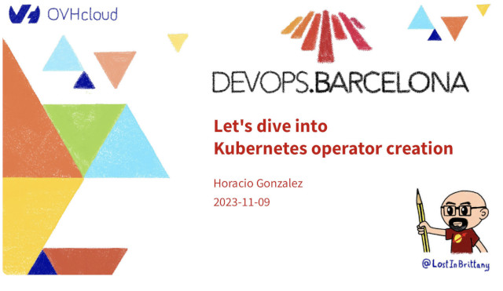
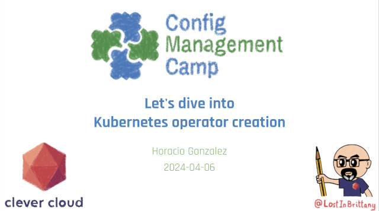

# Let's dive into Kubernetes operator creation

This repository stores all the code for my talk *Let's dive into Kubernetes operator creation*, that I have given at:

- 2023-11-09 - [DevOps Barcelona](https://devops.barcelona/) - [Slides](https://noti.st/lostinbrittany/vzc0uy/lets-dive-into-kubernetes-operator-creation)

    

- 2024-02-06 - [Config Management Camp](https://cfgmgmtcamp.eu/ghent2024/) - [Slides](https://noti.st/lostinbrittany/vzc0uy/lets-dive-into-kubernetes-operator-creation)

    

## Random Gopher container

In the [`/random-gopher-container`](./random-gopher-container/) folder, we have the specifications for the `random-gopher-container`, a small JS Express server that chooses a Gopher from [Aurélie Vache's Gopher repository](https://github.com/scraly/gophers/) at start-up and exposes it in its 8080 port on the `/gopher/name` endpoint.

The Random Gopher container is published in the Docker Hub as [lostinbrittany/random-gopher](https://hub.docker.com/r/lostinbrittany/random-gopher).

## Gopher API and UI

In the [`/gopher-api-and-ui`](./gopher-api-and-ui/) folder, we have the code for a Gopher API, allowing CRUD operations, and a small UI to show the Gophers currently stored in the API server.

### Usage

```sh
npm install
npm run start
```

At every startup, `gopher-api-and-ui` generates and API key that you need to send in a `x-api-key` header for all request modifying the contents of the API server (create, modify or delete gophers).

```
$  npm run start

> @lostinbrittany/gopher-api-and-ui@1.0.0 start
> node index.js

API key 8buffsrl370w85xdm5evea029i7osv
Listening at http://:::8080
```

## Manifests

In the [`/manifests`](./manifests/) folder there are several Kubernetes manifests:

- `random-gopher-deployment.yaml`: a manifest that deploys several replicas of `random-gopher-container`, each one exposing a random gopher.

- `gopher-api-crd.yaml`: a custom resource definition (CRD) to describe the Gopher API from the Kubernetes point of view, basically a `endpoint` and an `apiKey` properties.

- `gopher-api-cr.yaml`: an instance of the Gopher API CRD, with the definition of the currently configured Gopher API.

- `gopher-operator-rbac.yaml`: a manifest defining a Service Account and the RBAC needed to deploy and use the operator in the cluster.